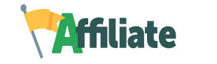

<p align="center">
  
</p>

<p align="center">
  
  
  
  
</p>

<p align="center">
  <a href="https://ik-web.github.io/keep-in-touch/">
    ⮚⮚ DEMO LINK ⮘⮘
  </a> 
</p>

## Description:
```
Practical project - adaptive landing page "Affiliate",
to consolidate page layout skills using Tailwind CSS framework.
```
## Documentation

 **Frameworks dokumentation:** <br>
- [Get started with Tailwind CSS](https://tailwindcss.com/docs/installation) <br>
- [SVG icons by the makers of Tailwind CSS](https://heroicons.com/)

 **The npm commands used to install the required node modules:**
- `npm init` initialization of the project
- `npm install -D tailwindcss` install Tailwind CSS framework
- `npx tailwindcss init` create Tailwind CSS config file
- `npx tailwindcss init --full` create Tailwind CSS config file with all options

## Developers

- [Ihor Kuchin](https://github.com/ik-web)
